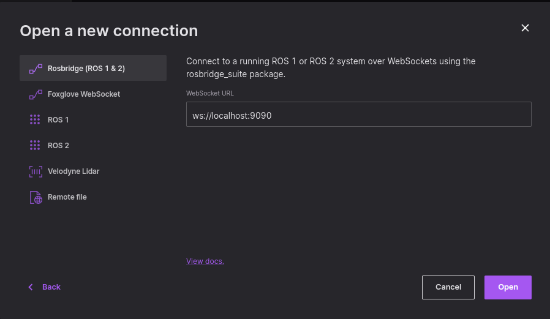

# ROS Workspace for Autonomous Kart Project

This repository contains the ROS workspace for the Autonomous Kart Project.

## Installation Steps:

- It is better to follow the steps using Ubuntu 18.04 LTS or Ubuntu 20.04 LTS. In case you are a windows machine user, you can use Ubuntu 20.04 LTS on Windows 10 using WSL2 or install a virtual machine with Ubuntu 20.04 LTS
- Install ROS Melodic or ROS Noetic. Follow the steps from [here](https://linuxopsys.com/topics/install-ros-noetic-on-ubuntu)
- run the following command:
```bash
catkin_make
```
- The last command should generate two folders: `build` and `devel`
- run the following command:
```bash
source devel/setup.bash
roslaunch rosbridge_server rosbridge_websocket.launch
```
- The expected output is the following image:

- Download the testrosbag from this link: [testrosbag](https://github.com/IPNL-POLYU/UrbanNavDataset/blob/master/README.md#urbannav-hk-medium-urban-1). Refer to [this link](https://github.com/IPNL-POLYU/UrbanNavDataset/blob/master/README.md) for the complete sensor setup and rosbag description
- Update line 26 in `talker2.py` with the path to the downloaded rosbag
- Download and install anaconda from [here](https://repo.anaconda.com/archive/Anaconda3-2022.10-Linux-x86_64.sh)
- Install `Anaconda` using the following commands:
```bash
sudo apt install ./Anaconda3-2022.10-Linux-x86_64.sh
conda env create -f environment.yaml
conda activate kart_env
```
```
- Open another terminal and run the following command:
```bash
source devel/setup.bash
rosrun first_package talker2.py
```
- The expected output is the following image:

- Open `foxglove`, choose `Open Connection` and write the following URL: `ws://localhost:9090` under `Rosbridge (Ros1 & 2) tab, as shown in the attached image:

